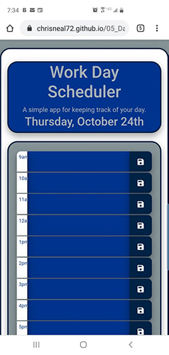

# 05_Day_Planner

### Table of Contents
- [Description](#Description)
- [Technologies-Libraries](#Technologies-Libraries)
- [Screenshots](#Screenshots)
- [Link](#Link)
​
### Description
This is a simple single day planner.  The date at the top in dynamic by using the moment.js script. The rows for the time of day are static in the HTML. The JQuery unctionality sets up the page with any stored values and creates the listeners for the save buttons.

Each line saves independantly. What is typed in for 9am is only saved if the button on the 9 am row is clicked. The values are stored in localStorage
​
### Technologies-Libraries
- [jQuery](https://code.jquery.com/) - jQuery
- [Bootstrap](https://getbootstrap.com/) - CSS Framework
- [Moment.js](https://momentjs.com/) - Time/Date JS
​
### Screenshots
​

​

​
### Link
Check it out! 
https://chrisneal72.github.io/02_Responsive_Portfolio/